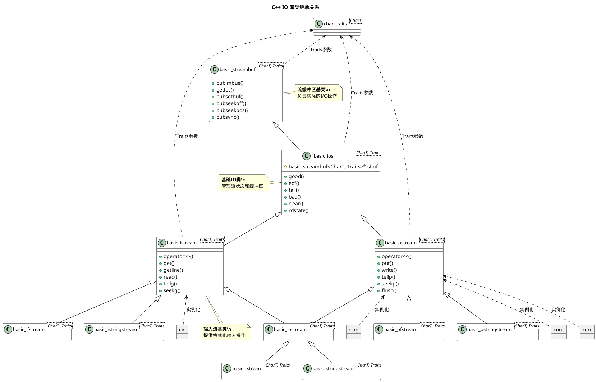
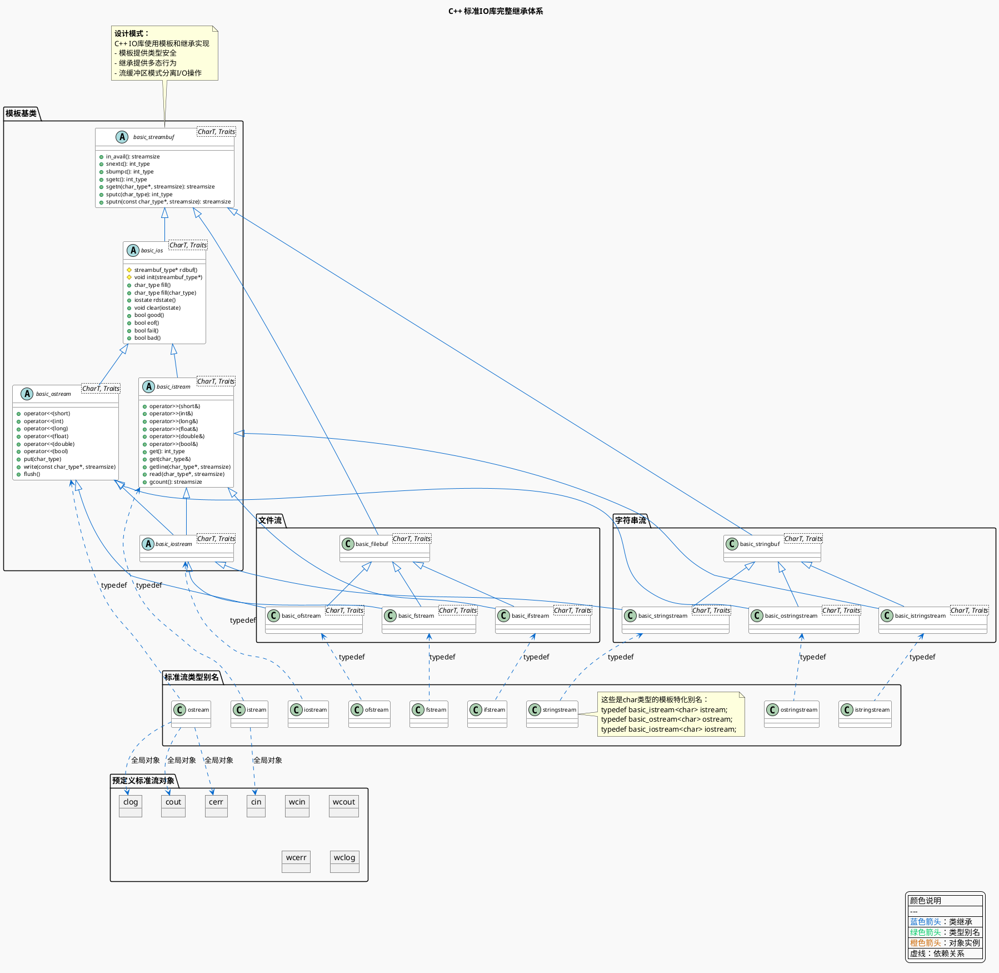

C++ 使用标准库类来处理面向流的输入和输出：

-   iostream 处理控制台 IO
-   fstream 处理命名文件 IO
-   stringstream 完成内存 string 的IO

<!--listend-->

```text
ios_base
 └── basic_ios
      ├── basic_istream
      │    ├── istream
      │    │    └── ifstream / istringstream
      │    └── wistream
      ├── basic_ostream
      │    ├── ostream
      │    │    └── ofstream / ostringstream
      │    └── wostream
      └── basic_iostream
           ├── iostream
           │    └── fstream / stringstream
           └── wiostream
```








